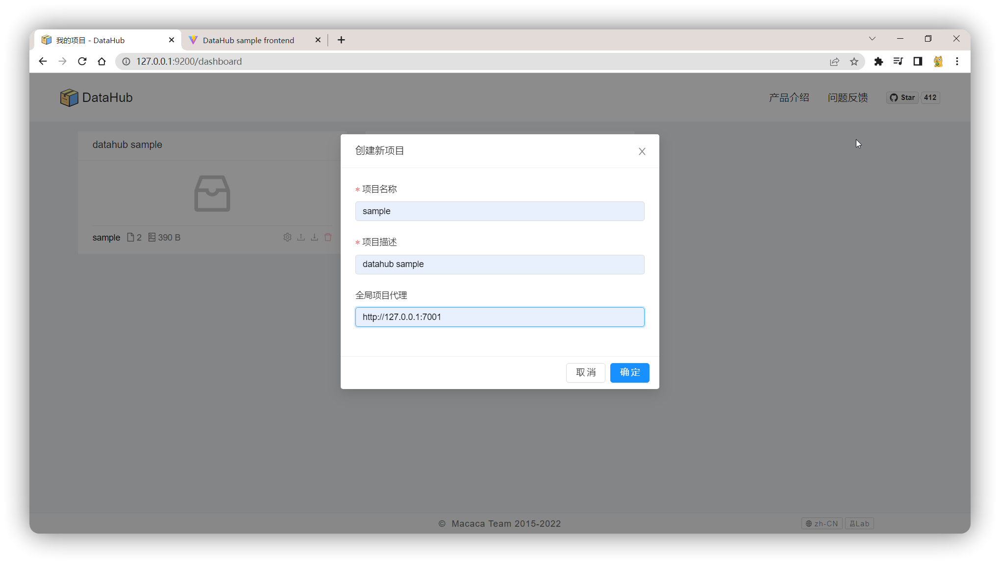
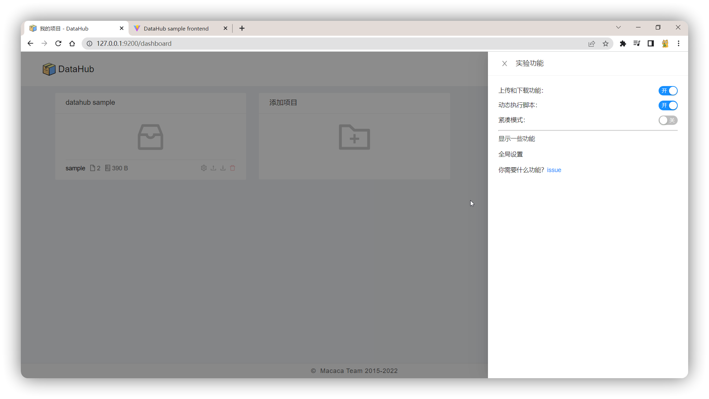
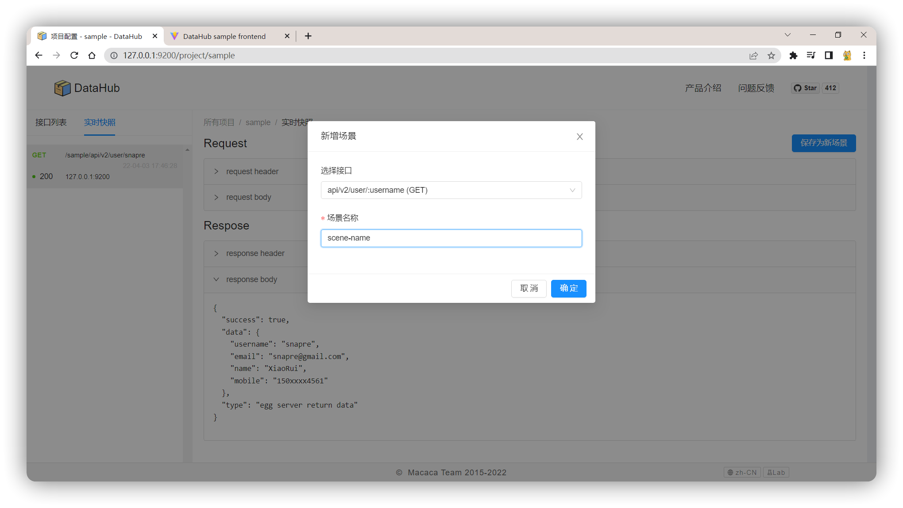

# DataHub sample
> 如何用 DataHub 解决前端工程师开发过程中的数据 Mock 问题

[![CI][CI-image]][CI-url]

[CI-image]: https://github.com/snapre/datahub-sample/actions/workflows/contributors.yml/badge.svg
[CI-url]: https://github.com/snapre/datahub-sample/actions/workflows/contributors.yml

## 启动前端开发服务 (React + Vite)
```bash
$ cd frontend
$ npm install
$ npm run dev
```

## 配置 DataHub 环境

1. 全局安装 macaca-datahub:
```bash
$ npm install macaca-datahub -g
```

2. 一键启动服务:
```bash
$ datahub server
```

3. 打开 DataHub 启动的地址:
```bash
$ http://127.0.0.1:9200
```

4. 创建一个 Hub 并打开数据上传模式:



5. 导入此目录下的模板数据: `project_sample.json`


6. 进入刚创建的 Hub，开始用 DataHub 助力前端开发:


## Just enjoy the data out-of-the-box


## 进阶

### 启动后端服务联调 (Eggjs)
```bash
$ cd server
$ npm install
$ npm run dev
```

### 可在联调阶段通过实时快照快速录入场景数据
<!-- GITCONTRIBUTOR_START -->

## Contributors

|[<br/><sub><b>snapre</b></sub>](https://github.com/snapre)<br/>|[<br/><sub><b>github-actions[bot]</b></sub>](https://github.com/apps/github-actions)<br/>|
| :---: | :---: |


This project follows the git-contributor [spec](https://github.com/xudafeng/git-contributor), auto updated at `Tue Apr 19 2022 11:17:04 GMT+0000`.

<!-- GITCONTRIBUTOR_END -->